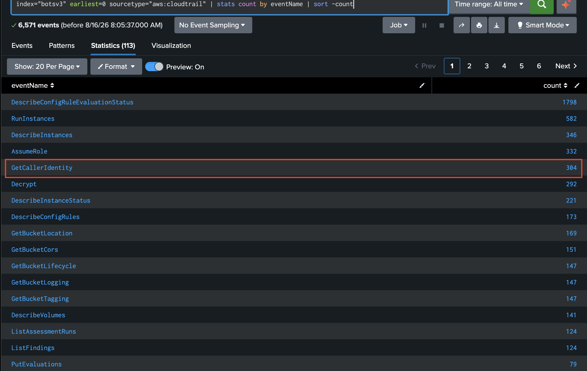
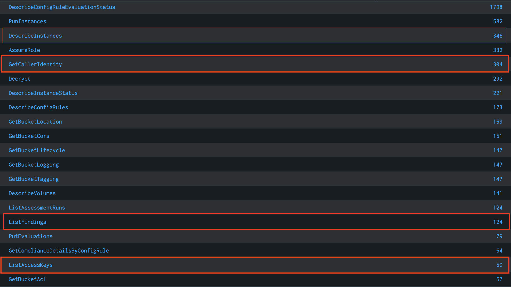
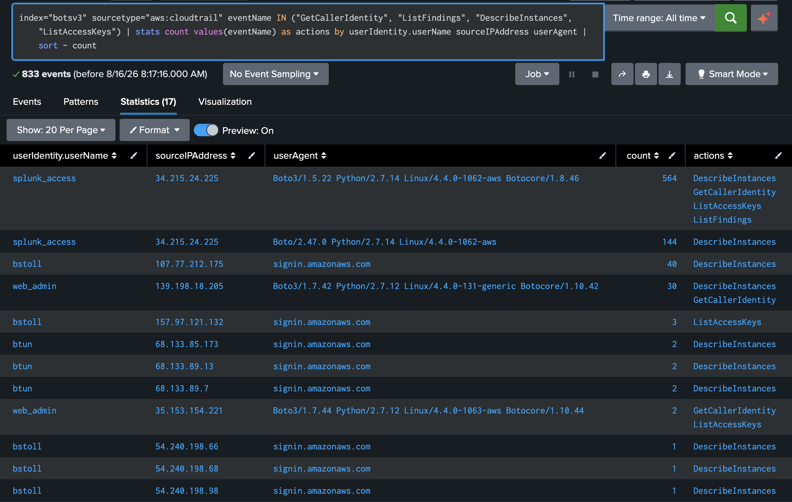
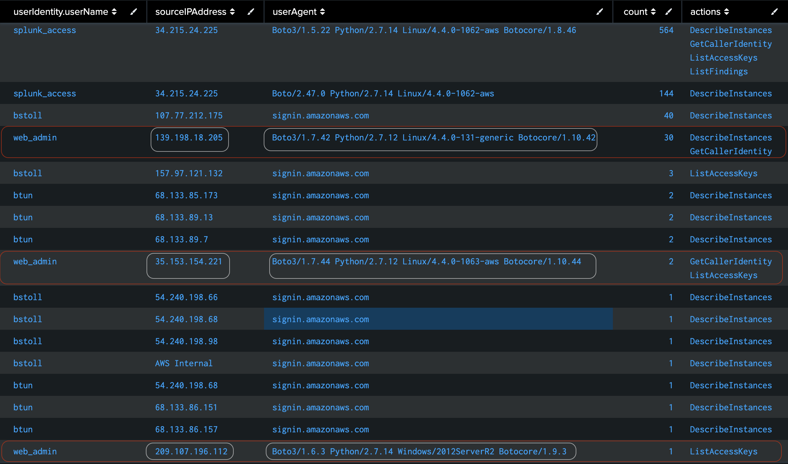
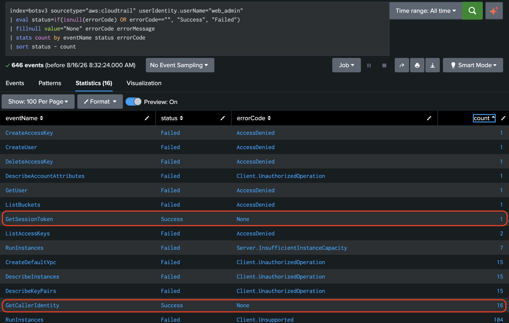
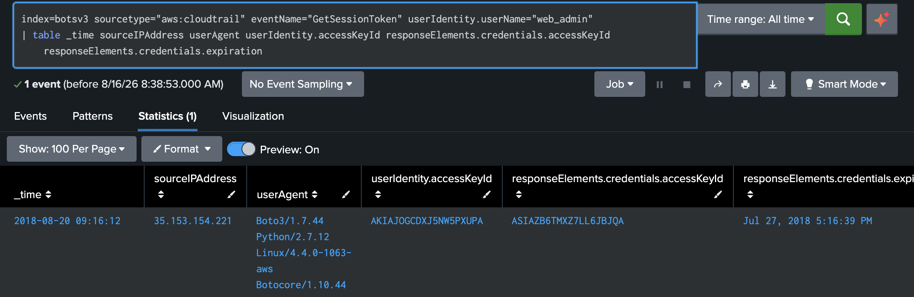
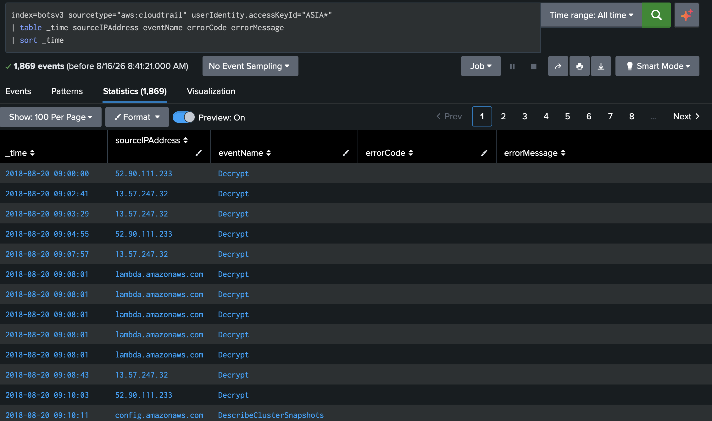

# SOC-Splunk-BOTSv3: Hypothesis-Driven Threat Hunting Simulation

## Overview

This project simulates a real-world Security Operations Center (SOC) threat hunting exercise using Splunk Enterprise and the Splunk BOTSv3 (Boss of the SOC Version 3) dataset — a publicly available, pre-indexed dataset containing a full day of real enterprise attack telemetry.

The goal is to move beyond passive alert triage and demonstrate hypothesis-driven, proactive threat hunting: formulating a detection hypothesis grounded in the MITRE ATT&CK framework, querying relevant logs using Splunk Query Language (SPL), isolating anomalous behavior, and documenting a full investigative verdict — mirroring the actual workflow of a SOC analyst.

## Tools Used

| Tool | Purpose |
|---|---|
| Splunk Enterprise (SIEM) | Log ingestion, management, and searching |
| Docker | Containerize and run the Splunk instance locally |
| Splunk BOTSv3 | Pre-indexed dataset containing real-world enterprise attack telemetry |
| MITRE ATT&CK Framework | Reference standard to align threat hypotheses with real-world attacker techniques |

## What It Aims to Achieve

- Demonstrate practical competence in SIEM management, log analysis, and Splunk Query Language (SPL)
- Prove the ability to execute hypothesis-driven, proactive threat hunting rather than just reacting to automated alerts
- Provide a tangible, hands-on security operations project to showcase on a resume or discuss during technical interviews

## Threat Hunting Hypothesis

**MITRE ATT&CK Technique:** T1078.004 — Valid Accounts: Cloud Accounts

This investigation is framed around the hypothesis that an attacker gained unauthorized access to cloud resources through the use of valid, legitimate cloud account credentials rather than exploiting a technical vulnerability. This technique is difficult to detect with signature-based tools since the activity blends in with normal authenticated behavior.

The hunt focuses on AWS CloudTrail logs within the BOTSv3 dataset to identify anomalous authentication patterns, unusual account activity, or signs of credential misuse consistent with T1078.004.

## Investigation

### Step 1 — Initial Discovery: CloudTrail Event Enumeration

To begin the hunt, CloudTrail logs were queried to get a baseline view of API activity within the environment.

```spl
index=botsv3 sourcetype="aws:cloudtrail" earliest=0 | stats count by eventName | sort - count
```



This surfaced several event types that stood out as worth investigating further: `GetCallerIdentity`, `ListFindings`, `DescribeInstances`, and `ListAccessKeys`. These are commonly associated with attacker reconnaissance activity in cloud environments: identity verification, infrastructure discovery, and credential enumeration.



### Step 2 — Pivoting on Suspicious Events

The four flagged event names were then correlated against user identity, source IP, and user agent to identify who was generating this activity.

```spl
index=botsv3 sourcetype="aws:cloudtrail" eventName IN ("GetCallerIdentity", "ListFindings", "DescribeInstances", "ListAccessKeys") | stats count values(eventName) as actions by userIdentity.userName sourceIPAddress userAgent | sort - count
```



This identified the user `web_admin` as the most suspicious actor, for two reasons:

 1. **Anomalous tooling** — rather than using the AWS Management Console (the expected interface for this type of account), the actor's requests originated from a Python script using the boto3 SDK, visible via the userAgent field.
 2. **Reconnaissance-pattern IP activity** — the account's activity came from three source IPs: 139.198.18.205 (30 requests, primarily `GetCallerIdentity` and `DescribeInstances`), 35.153.154.221, and 209.107.196.112.

The sequence of actions itself followed a recognizable reconnaissance pattern consistent with T1078.004: the actor first confirmed their own identity and privileges (`GetCallerIdentity`), then enumerated running EC2 infrastructure (`DescribeInstances`), then queried IAM credentials tied to the account (`ListAccessKeys`).




### Step 3 — Drilling Down: Success - Failure Analysis

With web_admin identified as the suspicious account, the next step was to determine the full scope of activity: what the actor attempted, and what actually succeeded.


```spl

index=botsv3 sourcetype="aws:cloudtrail" userIdentity.userName="web_admin"
| eval status=if(isnull(errorCode) OR errorCode=="", "Success", "Failed")
| stats count by eventName status errorCode errorMessage
| sort eventName - count
```


This returned 646 total API calls attributed to web_admin. The majority failed, but a handful succeeded — most notably `GetCallerIdentity` (16 calls, success) and `GetSessionToken` (1 call, success). The failed attempts included `RunInstances` (576 calls), `CreateDefaultVpc` (15 calls), `DescribeKeyPairs` (15 calls), `DescribeInstances` (15 calls), `DeleteAccessKey` (1 call), and several others.


Piecing together the sequence of events:

1. **Identity confirmation** — The actor validated the stolen web_admin credentials were live via `GetCallerIdentity` (16 calls), then successfully established a temporary session using `GetSessionToken`.
2. **Attempted persistence** — With basic access confirmed, the actor attempted to establish a foothold by creating a backdoor IAM account (CreateUser: `my_db_usr`) and a secondary access key (`CreateAccessKey`). Both attempts were blocked by IAM permissions (`AccessDenied`).
3. **Attempted resource abuse** — The actor then ran an automated script targeting EC2 compute infrastructure (`RunInstances`, 576 requests; `CreateDefaultVpc`, 15 requests), which failed due to a combination of missing permissions, unsupported configurations, and account limit boundaries.

### Step 4 — Tracing the Session Token

To confirm the scope and timeline of the actor's active access, the successful `GetSessionToken` event was isolated to trace the temporary credentials issued.

```spl

index=botsv3 sourcetype="aws:cloudtrail" eventName="GetSessionToken" userIdentity.userName="web_admin"
| table _time sourceIPAddress userAgent userIdentity.accessKeyId responseElements.credentials.accessKeyId responseElements.credentials.expiration
```


This confirmed the adversary actively used a minted AWS STS temporary token (`ASIA...`) to execute commands within a defined window, between **09:16:14 UTC and 09:28:54 UTC**.

[Screenshot: step4_session_token_trace.png]

## Step 5 — Reconstructing the Session Activity Timeline

With the temporary session token identified, the final step was to reconstruct exactly what the actor did while that token was active — building a full chronological timeline of actions tied to the stolen session.

```spl
index=botsv3 sourcetype="aws:cloudtrail" userIdentity.accessKeyId='ASIA*' 
| table _time sourceIPAddress eventName errorCode errorMessage
| sort _time
```


This produced a complete, time-ordered record of every action taken under the compromised session token, tying together the identity confirmation, persistence attempts, and resource abuse attempts documented in Steps 3 and 4 into a single verifiable attack timeline.

## Findings & Verdict

| Field | Detail |
|---|---|
| **Severity** | High (Contained / True Positive) |
| **Affected Account** | `web_admin` (`arn:aws:iam::[REDACTED]:user/web_admin`) |
| **Attacker Infrastructure** | IP `139.198.18.205`, tooling: Python `Boto3` SDK |
| **Confidentiality Impact** | Low — limited to IAM caller identity enumeration |
| **Integrity Impact** | None — privilege escalation and VPC/user creation attempts were blocked |
| **Availability Impact** | None — mass EC2 instance deployment attempts failed |

**Summary:** The investigation confirmed unauthorized use of valid `web_admin` cloud credentials (MITRE ATT&CK T1078.004), consistent with the initial hypothesis. The actor successfully authenticated and established a temporary session via stolen credentials, but was unable to escalate privileges, establish persistence, or provision infrastructure due to IAM permission boundaries. The incident is classified as contained, with no confirmed impact to data confidentiality, integrity, or availability.

### Immediate Remediation / IR Handover Checklist

- Deactivate and delete the compromised static access key (`AKIA...`) on the `web_admin` user.
-  Invalidate all active AWS STS temporary session tokens (`ASIA...`) to sever the adversary's active connection.
-  Implement IAM boundary policies restricting programmatic `sts:GetSessionToken` calls to approved internal IP ranges or requiring Multi-Factor Authentication (MFA)


## Repository Structure

```
soc-splunk-botsv3/
├── README.md
├── queries/
│   └── spl_queries.md
└── screenshots/
    ├── ss1
    ├── ss2
    ├── ss3
    ├── ss4
    ├── ss5
    ├── ss6
    └── ss7
```
